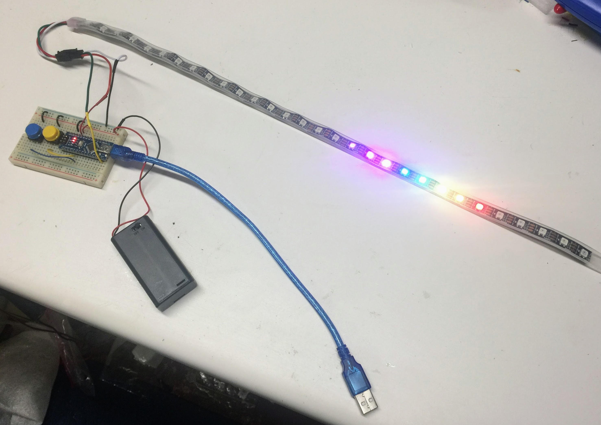

# Costume Kit Purchasing Guide

The following parts lists are designed for our annual Halloween Costume Project.  We have been doing these classes since 2014 in conjunction with the IoT Hackday project. We think it is a great way to get kids interested in programming.  Special thanks to Justin Grammens for all his help organizing these events.

In addition to these kits, you will need a PC or laptop with a USB port that you can install the Arduino IDE and Arduino device drivers.  If you don't have admin rights to your computer you can't use it for this project.

These kits assume that you have a soldering iron and solder.  But you don't have to do a lot of soldering!  The LED strips only have three wires that need to be connected. If you use a breadboard you can get by with minimal soldering.  It helps to have some 24-gauge solid-core wire to solder wires that can easily slide into the breadboards.  For elaborate costumes that have LEDs on different parts of the costume we suggest black 26-gauge stranded wire.  The stranded wire is more flexible and will not break after being bent repeatedly.  See below for sample links.

If you are a cost-conscious buyer, we strongly suggest you start to order your parts around mid-September.  This allows the lower cost parts to be ordered from China.  They take 2-3 weeks to arrive and if you don't get them by the first week of October you can still reorder some missing parts.

## Getting Low-Cost Hardware From eBay/China In Time
If you are a good planner and willing to do some work you can get very low-cost parts from China at a fraction of the prices you see on Amazon or in various kits.  Just remember that the parts should be ordered 2-3 weeks before your courses start.

For the Hardware Courses here are the typical components you will use:

| Part Name   |  Description      | Price | Link   | Note |
|-------------|-------------------|------:|--------|------|
| Arduino Nano| Arduino Nano ATmega328 CH340G Mini USB. The main processor in a low-cost and breadboard-friendly package.  Some version require you to solder in your own header pins and some are "pre-welded" meaning the headers are soldered in. | $2.50 each | [ebay - solder your own](https://www.ebay.com/itm/Nano-V3-0-Mini-USB-ATmega328-5V-16M-Micro-controller-CH340G-board-For-Arduino/202988007585) | Note this version will require you to solder on the headers. |
| Mini USB Cable | Short Mini USB cable for connecting the Arduino to the PC's USB port | $1.00 | [ebay](https://www.ebay.com/itm/1-2-5-10PCS-Mini-Type-C-Micro-USB-Nano-V3-0-5V-ATmega328-CH340G-Kit-For-Arduino/143495610440) | check you computer to see what type of cable you need |
| 400 Tie Solderless Breadboard | This 1/2 size breadboard has 400 ties and is big enough for most beginning projects.  It is also small enough for students to carry in a backpack | $1.50 each | [ebay](https://www.ebay.com/itm/Solderless-Breadboard-400-Point-Tie-Prototype-Test-Bread-Board-PCB-For-Arduino/283953769724) | The Nano fits directly into this breadboard |
| LED Strip | 1 meter of 60 pixels using the WS2812B standards | $8.00 | [eBay](https://www.ebay.com/itm/WS2812B-5050-RGB-LED-Strip-30-60-96-144LEDs-M-Individual-Addressable-IC-DC5V/383303087840) [eBay](https://www.ebay.com/itm/WS2812B-Strip-LED-Lights-5050-RGB-30-60-144-LED-M-IC-Individual-Addressable-DC5V/273348048838) | I like the ip65 waterproof in silicon coating with the black background |
| Breadboard Jumper Wires | 65 Male-to-Male jumpers of various lengths | $2.50 for 65 | [ebay](https://www.ebay.com/itm/65Pcs-Male-to-Male-Breadboard-Jumper-Cable-Wires-Kit-for-Arduino-Circuit-Set/264315948957)| Reuse for many projects |
| Battery Pack | 3 AAA 4.5V Battery Pack  with Switch | $1.90 | [ebay](https://www.ebay.com/itm/1pcs-3x-AAA-3A-4-5V-Cell-Battery-Holder-Box-Case-With-Switch-6-Lead-Wire-Black/300903936992) |

## The Amazon Option (Fast but more expensive)

Here are some links from Amazon:

| Part | Price | Link |
|--|--|--|
| Arduino Nano | $9 | [FTCBlock Mini Nano V3.0 ATmega328P Microcontroller Board with USB Cable for Arduino (1pcs Board+1pcs Cable)](https://www.amazon.com/FTCBlock-ATmega328P-Microcontroller-Board-Arduino/dp/B07H31FS8J/ref=sr_1_12_sspa)
| LED Strip | $11 | [BTF-LIGHTING WS2812B RGB 5050SMD Individual Addressable 3.3FT 60(2x30) Pixels/m Flexible Black PCB Full Color LED Pixel Strip Dream Color IP30 Non-Waterproof Making LED Screen, LED Wall Only DC5V](https://www.amazon.com/BTF-LIGHTING-Flexible-Individually-Addressable-Non-waterproof/dp/B01CDTED80/ref=sr_1_5) |
| 400 Tie Breadboard | $6 | [BB400 Solderless Plug-in BreadBoard, 400 tie-Points, 4 Power Rails, with Metal Backing Plate, 3.3 x 2.2 x 0.3in (84 x 55 x 9mm)](https://www.amazon.com/BB400-Solderless-BreadBoard-tie-Points-Backing/dp/B00Q9G8MQS/ref=sr_1_14) |

# Long Lasting Rechargeable Batteries

For those of you that don't want to have to run out to the store and purchase AAA or AA batteries each time the kids run out of power, one option is to invest in one of these incredible 5V Lithium rechargeable battery packs.  They will last about 10x longer than 3 AAA batteries and you can recharge them on any USB port of a laptop or a wall wart.

Here is a link to the new version of the PURSUN battery pack for $13.99 that has a built-in percentage power remaining indicator:

[PURSUN 10,000 mAh USB power pack with display $11.99](https://www.amazon.com/Updated-Compact-10000mAh-Technology-Portable/dp/B07YB9K7WJ/ref=sr_1_1?dchild=1&keywords=10000mah+with+percent+charged+display&qid=1600136038&sr=8-1)

[YOBON 12,000 mAh USB power pack with percent display $13.99](https://www.amazon.com/Portable-12000mAh-External-Powerpack-Smartphone/dp/B07ZNWFY5P)

[Aibocn Mini Power Bank 6700mAh $8.99](https://www.amazon.com/dp/B078PYMRTK/?coliid=I3EIC29FT51JJR)
Another favorite is the Anker PowerCore for about $20 on Amazon:

[Anker PowerCore 10000 Portable Charger](https://www.amazon.com/Anker-PowerCore-Ultra-Compact-High-Speed-Technology/dp/B0194WDVHI/ref=sr_1_15)

These chargers can double the cost of the kits, but they really are nice and they can also charge your cell phone!

## Buttons and Potentiometers
Some students like to modify their costumes with switches that change the pattern or change the speed or brightness.  Here are parts you can use for these:

[Push Button: Tactile Push Button Switch Momentary Tact & Cap 12x12x7.3mm Assorted Kit Arduino USD $8.99](https://www.ebay.com/itm/Tactile-Push-Button-Switch-Momentary-Tact-Cap-12x12x7-3mm-Assorted-Kit-Arduino/222517498810)

[10K Ohm Linear Potentiometer](https://www.ebay.com/itm/B10K-Electrical-With-Knob-Rotary-Potentiometer-Accessories-Linear-Switch-WH148/254691066223)

## Neopixel Rings

Some of our students love the Neopixel rings.  They come in several sizes but they often require some fine soldering work.

[1, 8, 12, 16, 24 Neopixel Ring Set $20.00 USD](https://www.ebay.com/itm/1-8-12-16-24-LED-Ring-Set-WS2812-RGB-Compatible-with-Neopixel/254001827423)

## Extra Wire
For costumes that have LED sewn through the costume you will need extra flexible stranded wire.  We like the 28 gauge stranded wire for this.

[28 AWG Flexible Stranded Wire on eBay](https://www.ebay.com/itm/14AWG-28AWG-Flexible-Stranded-Silicone-Wire-Tinned-Copper-Line-11-Colors-5M-10M/184410755004)