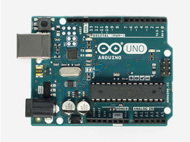
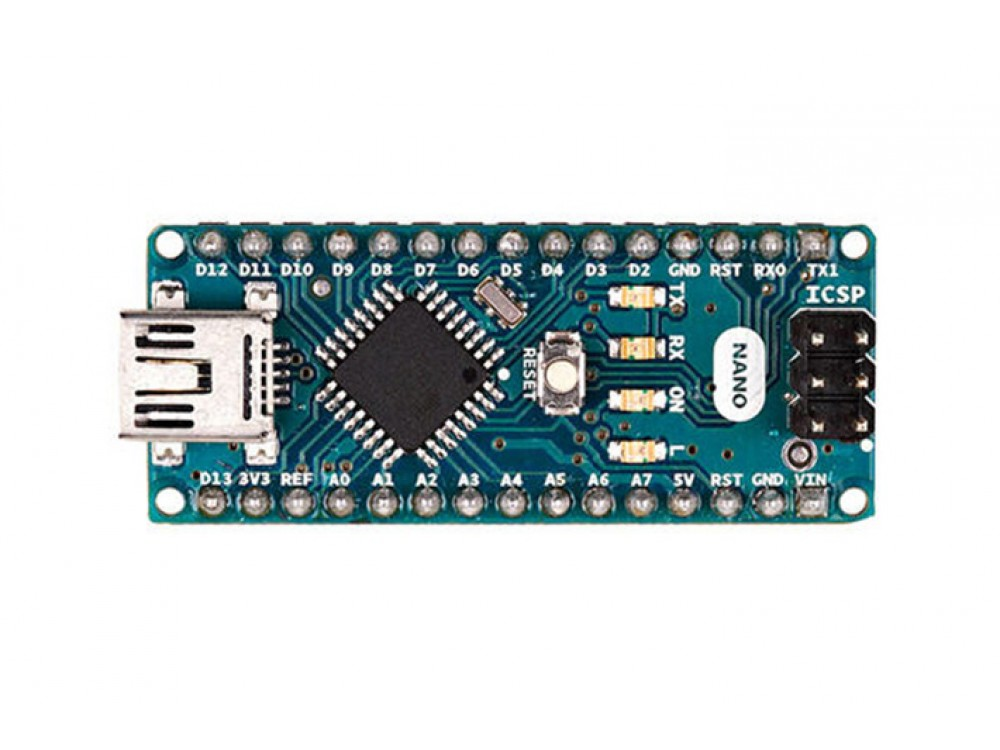

# Introduction to Arduino

## Course Types
There are three types of courses in the CoderDojo Twin Cities Arudino:

1. **Online Courses** - These courses are taught in virtual environments and don't require any hardware for our students.  We use web sites like TinkerCad to simulate the behavior of Arduino devices.

2. **Hardware Courses** - These courses require you to have general Arduino hardware and sensors used by the students or mentors. Note that you can still teach these courses online.  Many of the hardware lab programs can also be simulated online.

3. **Project Courses** - These courses often require a specific combination of hardware that the students will build for example a Simon or Pong game.  

Each of the hardware courses are designed to use low-cost Arduino hardware.  We use low-cost Arduino Nanos for many labs since they can be purchased for around $2.50USD.

## Pre-course setup
The online courses don't require any physical setup.  However, you should have the parents create an account on TinkerCad and learn how to save and run sample programs.  See the Introduction section for each course for details.

## Arduino Uno vs Nano

 

We use both the Uno and the Nano in our classrooms. The main difference between these two is the size. Because Arduino Uno size is double to nano board. So Uno boards use more space on the system. The programming of UNO can be done with a USB cable whereas Nano uses the mini USB cable.

We also use Nanos for our projects since they can easily fit on a breadboard and we can get them in bulk for around $3 from China.  This is called a DIP-30 package (Dual Inline Package with 30 pins).

