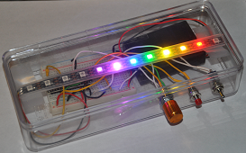

# Arduino Resources

This GitHub repository contains resources for teaching Arduino in various settings including hands-on and virtual classes. This repository includes curriculum, lesson plans, labs, sample programs and teaching resources such as slides and glossaries.

## Tinkercad
This is just the basics of creating Arduino circuits using the Tinkercad web-based Arduino simulator.  We start out with the Blink lab and then go on to use many LEDs, add sensors and other projects that demonstrate various Arduino programming concepts.

## Tinkercad LED Strips
This course is ideal for students to learn how to program the low-cost LED strips.  Once the students master the online labs they can purchase their own kits or participate in our popular costume contests or create "art bikes" that glow with patterns at night.  [Iinkercad LED Strips Course](./tinkercad-neopixel/00-intro.md).

## Arduino Classic Projects
These labs use standard Arduino Nano hardware to keep the costs of our projects low.  You can also use the Arduino Uno for these courses, however the packaging will need to be modified for many of the projects.  Our focus is a wide variety of low-cost Arduino projects (usually under $15) that students can make, throw in their backpacks, take to school and show their friends why coding rocks!

## Arduino Displays
This course has a narrow focus using displays with the Arduino.  We have many labs that use low-cost OLED displays to create fun low-cost games that students can easily put in a backpack and take to school.  The pong game is a favorite with our students.

## Moving Rainbow
This site has many projects that use the low-cost Arduino Nano and LED strips.  We are in the process of moving the content to support mkdocs on GitHub pages.
The site also has teaching materials for your own events.
 
[Arduino Moving Rainbow](https://github.com/dmccreary/moving-rainbow).

## CoderDojo Robots
This site has many projects base on the low-cost ($25) CoderDojo Arduino Robot Kit. 
[$25 Robot Platform for Teaching Programming on Instructables](https://www.instructables.com/Collision-Avoidance-Robot-for-Teaching-Programming/) 
[CoderDojo Robots](http://dmccreary.github.io/coderdojo-robots/)

