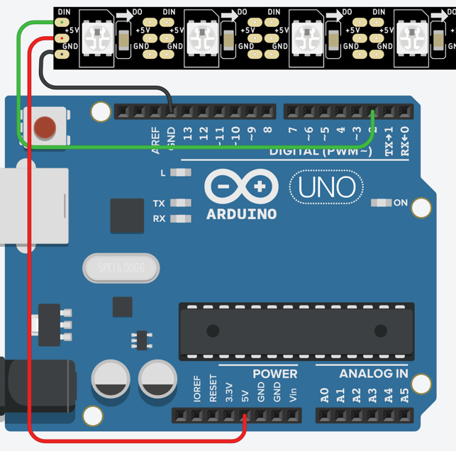

# Neopixel Blink
In this lab, our goal is to duplicate the functionality of the classic single LED blink lab.  We will only make the first pixel of a NeoPixel strip turn the red LED on and off.

## Circuit



## Code

### Preamble

```C
#include <Adafruit_NeoPixel.h>
#define PIN 2
#define NUMPIXELS 12
Adafruit_NeoPixel pixels = Adafruit_NeoPixel(NUMPIXELS, PIN, NEO_GRB + NEO_KHZ800);
```

### Setup
In our setup function we need to initialize the NeoPixel data structure.  This will allocate enough memory to store the state of the pixels.  We will need to allocate enough RAM to store an eight-bit (one byte) value for each red, green and blue light intensity level for each of our pixels.

```C
void setup() {
  pixels.begin();
}
```

## Main Loop
Our main loop will do the following steps:

1. It will set the red value of the first pixel (pixel 0) to be its full brightness: 255.
2. It will then send this value to the LED strip using the **pixels.show())**
3. It will then pause a half-second or 500 milliseconds using the **delay(500)** function.
4. It will then et the red value of the first pixel (pixel 0) to be off a value of 0.
5. It will then pause for another half-second.

```C
void loop() {
  pixels.setPixelColor(0, 255, 0, 0);
  pixels.show();
  delay(500);
  pixels.setPixelColor(0, 0, 0, 0);
  pixels.show();
  delay(500);
}

### Full Code
```C
#include <Adafruit_NeoPixel.h>
#define PIN 2
#define NUMPIXELS 12
Adafruit_NeoPixel pixels = Adafruit_NeoPixel(NUMPIXELS, PIN, NEO_GRB + NEO_KHZ800);

void setup() {
  pixels.begin();
}

void loop() {
  pixels.setPixelColor(0, 255, 0, 0);
  pixels.show();
  delay(500);
  pixels.setPixelColor(0, 0, 0, 0);
  pixels.show();
  delay(500);
}
```

## Link Working Example
https://www.tinkercad.com/things/9N27JUfFSCe

## Experiments

1. What happens if you change the last three numbers in ```pixels.setPixelColor()``` function?:

From:

 ```pixels.setPixelColor(i, 255, 0, 0);```

 To:

 ```pixels.setPixelColor(i, 0, 255, 0);```
 
 Or:
 
 ```pixels.setPixelColor(i, 0, 0, 255);```
