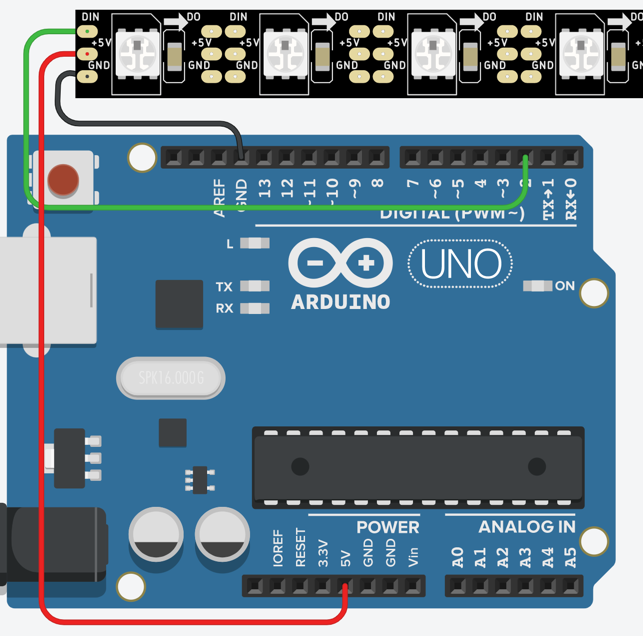

# Neopixel Back and Forth
In this lab, our goal is to make a single-pixel move down the LED strip and then go back.

## Circuit



## Code

```C
#include <Adafruit_NeoPixel.h>
#define PIN 2
#define NUMPIXELS 12
Adafruit_NeoPixel pixels = Adafruit_NeoPixel(NUMPIXELS, PIN, NEO_GRB + NEO_KHZ800);

int delay_time = 200; // 200 msec = 1/5th of a second

void setup() {
  pixels.begin();
}

void loop() {
  
  // from left to right
  for(int i=0; i<NUMPIXELS; i++){
    pixels.setPixelColor(i, 255, 0, 0);
    pixels.show();
    delay(delay_time);
    pixels.setPixelColor(i, 0, 0, 0);
    pixels.show();
  }
  
  // from right to left
  for(int i=NUMPIXELS; i>0; i--){
    pixels.setPixelColor(i, 255, 0, 0);
    pixels.show();
    delay(delay_time);
    pixels.setPixelColor(i, 0, 0, 0);
    pixels.show();
  }
  
  
}
```

## Link Working Example
[Link to Working Program on Tinkercad](https://www.tinkercad.com/things/izRFzjwAONe)

## Experiments