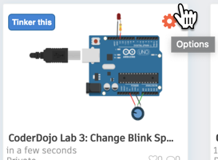
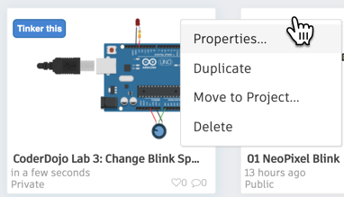
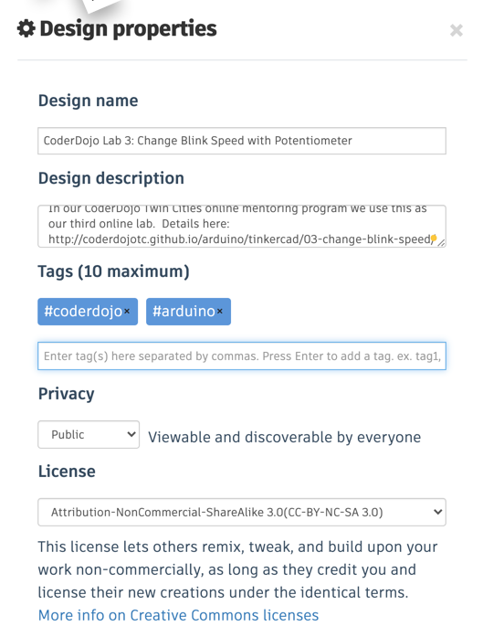

# Setting up Your Tinkercad(TM) Account

Tinkercad(TM) allows each student to have their own account so that you can keep programs that you have created and come back to them in the future.  Before you begin you should go to the Tinkercad web site and create a new account for each student.

[Tinkercad Web Site](https://www.tinkercad.com/)

Once you have an account setup, make sure you know how to clink on the Properties gear icon of each lab to make it public if you want to share it with other mentors and students.  B

## Focus on Tinkercad Circuits

Tinkercad was originally created to teach web-based Computer-Aided Design (CAD).  Later Tinkercad added support for Arduino.  However, you must be sure to navigate to the Circuits section of Tinkercad before you begin creating Arduino circuits.

## Setting Circuit Properties
Unfortunately, the current Tinkercad web application has some problems with usability for first time users.  There are also no tutorials and minimal help available online.  It is not intuitive how to change the properties of a circuit lab to make it public.  Here are the detailed steps to change the properties of a lab so you can share it with other students and mentors:

1. Open the list of your circuits view
2. Move your mouse over the selected lab. You must do this because the option "gear" is not visible when you just view all your labs.
3. Click on the Setting Gear control in the upper right of your lab
4. Select the "Properties" menu item
5. When you have the properties menu visible 

The images below show you what these look like:

### Getting to the Circuit Options:

### Selecting the Circuit Properties:

### Setting the Circuit Properties
If you want to share your circuit, set the to **Public**.  If you forget this step, others will not be able to see your circuits.

We also encourage our CoderDojo mentors to use the following license:

## Tinkercad Knowledge Base
Tinkercad has a list of frequently asked questions:

[https://tinkercad.zendesk.com/hc/en-us/sections/115002539667-Tinkercad-Circuits]
(https://tinkercad.zendesk.com/hc/en-us/sections/115002539667-Tinkercad-Circuits)

## Tinkercad Gallery of Circuits
We encourage our mentors and students to explore the gallery of Tinkercad circuits.
Here is a link that will provide you some sample circuits you can modify.

[https://www.tinkercad.com/learn/project-gallery;collectionId=OMOZACHJ9IR8LRE](https://www.tinkercad.com/learn/project-gallery;collectionId=OMOZACHJ9IR8LRE)

