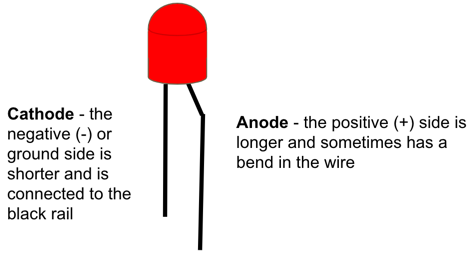
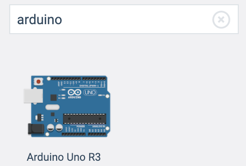
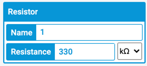
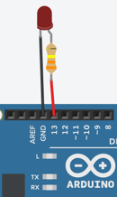

# Arduino Blink Lab

In this lab, we will learn how to make a Light Emitting Diode (LED) turn on and off at various speeds.
The Blink lab is kind of like "Hello world!" in Arduino: it is the first program most students learn.
Getting blink working is not always easy.  You will need to become familiar with using Tinkercad and
entering code into the system before you can run the example.

## LED Connections
The LED has two connectors on it.  But you should never connect both the wires directly to power.  That will burn out the LED.  The LED has a negative side (called the Cathode) and a positive site (called the Anode).  It is important that you always put a proper
resistor in the path of the circuit to limit the current.  In the case of a standard 5 volt Arduino we will use a
330-ohm resistor to limit the current to the LED.

It is important that you don't confuse these two sides.  If you don't hook them up correctly your circuit will not work!

Here is a picture of the cathode and anode of an LED.



## Remembering Cathode and Anode

Sometimes you can use a picture to help you remember which end is the cathode and which one is the anode.  I try to think of a short black "cat" to remember the negative cathode.  I also try to think of my friend Ann who is tall and loves red when I think of the Anode.  Here is a picture that you can use to remember this idea:


Sometimes it is hard to remember which side is which.  You 


## Circuit Diagram
Here is the circuit diagram we will use for our blink lab.


You can create this using the following steps:

### Step 1: Create a New Circuit
Go to the left navigation area and click the Circuits and press the green Create New Circuit button:


### Step 2: Add an Arduino Uno
Go to the right search area and type in "Arduino".  You should see the following image:



Now clink on the image and use your mouse to drag the icon of the Arduino to the main central area of your screen.

### Step 3: Add the LED and the resistor

Now go back to the right-side search area and enter "LED". You should see an image like this:


Note that in this diagram, the straight wire on the left is the cathode which goes to GND pin on the Arduino. The bent pin on the right is anode which goes through a resistor and then to a digital output pin.

### Step 4: Add the Resistor and Set it to be 330 ohms
Finally, we will also add a resistor to our circuit.  Go to the right side, type in "resistor" and you should see an image like this:


Unlike the LED, the resistor is just a generic component but we must next set the value of the resistor to be 330-ohms.  We do this
by clicking directly on the resistor in the circuit diagram and changing the value in the inspector region of the screen:


Note that the resistor should be set to be 220-ohms. Make sure you set both the number to be 220 and the value to be ohms (not kiloohms).

### Step 5: Make the connections
Now we have our three components on the screen.  We are ready to hook them up.  First, lets connect the left side of the LED (the cathode) to the
GND or ground negative pin of the Arduino. Once you have the wire connected you can select it and you will be able to change the color.  My convention, any wire that go to GND are typically colord black.


Now drag the 330 ohm resistor so it connect to the right pin of the LED and then add 


Your circuit should look like the following diagram:


## Code

Almost all Arduino programs have two main functions:

1. A **setup** function that runs once when the Aruduino powers up
2. A **loop** function that runs continually until the power is turned off (or the reset is triggered)

### The Setup Function
```C
void setup()
{
  pinMode(13, OUTPUT);
}
```

In our blink program the setup function just sets pin 13 as an output pin.  That is pretty simple.  You will notice that
the word **setup** is followed by an open and a closed parenthesis.  This is to indicate that there are no
parameters going into the function.

### The Loop Function
The loom function will do four functions

1. Turn the voltage of pin 13 HIGH (+5 volts)
2. Wait one second (1000 milliseconds) using the delay function
3. Turn the voltage of pin 13 LOW (ground or 0 volts)
4. Wait one second again

It repeats the on/off every second continually until the power is turned off.

```C
void loop()
{
  digitalWrite(13, HIGH);
  delay(1000); // Wait for 1000 millisecond(s)
  digitalWrite(13, LOW);
  delay(1000);
}
```

### The Full Program

Here is the full program:

```C
void setup()
{
  pinMode(13, OUTPUT);
}

void loop()
{
  digitalWrite(13, HIGH);
  delay(1000); // Wait for 1000 millisecond(s)
  digitalWrite(13, LOW);
  delay(1000);
}
```
You can type this into the Tinkercad program or do a copy here and paste it into the code area.

## Working example on Tinkercad

[Blink on Tinkercad](https://www.tinkercad.com/things/f3seilzyLGu-blink)

## Experiments

1. What happens if you change the delay times (currently set at 1000) to be 100?
2. What happens if you change the delay times to be 50?
3. What happens if you change the delay times to be 20?
4. What happens if you change the delay times to be 10?  Can you still see the blinking at all?


## Food for thought
Most movies are shown around shown at 24 frames per second?  Why do you think they picked this speed?

If you hook up a photo sensor to a florescent light bulb you will see that it flickers 120 times per second.  Household current runs at half this rate (60 times per second).  Why do you think that the light flicker rate is twice the frequency?  Hint: draw a wave that goes positive and negative.  Look up [Sine Wave](https://en.wikipedia.org/wiki/Sine_wave) in Wikipedia.

What did you learn about the human eye?

If you would like to learn more about LED circuits here is a [Wikipedia Article on LED Circuits](https://en.wikipedia.org/wiki/LED_circuit)
