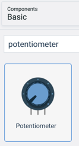

# Arduino Change Blink Speed with Potentiometer

In this lab we will use a potentiometer to make an LED change its blink speed.  The circuit will be similar to the blink lab with the addition of a potentiometer that has its middle wire going into analog input port A0.

## Creating the Circuit

### Start with the Blink Lab
Here is the circuit diagram we will use for our blink lab.

### Add the Potentiometer



### Connect the Potentiometer


## Code
In the first programs we only had a simple setup and a loop.  But this progam will also need to add a variable declaration before the setup.

### Declaring a Variable
We will need to declare a variable to hold the value of the potentiometer.  In C we will need to declare that it is of type integer with the **int**.

```C
int sensorValue = 0;
```

### The Setup Function
Just like the Blink Lab, we will need to make pin 13 be an digital OUTPUT pin.  But in this lab we also need to set the Analog pin A0 to be an INPUT port.

```C
void setup()
{
  pinMode(13, OUTPUT);
  pinMode(A0, INPUT);
}
```

### The Loop Function
The loom function will do perform the following steps

1. Read the value of the potentiometer
2. Wait a delay time which is the value of potentiometer using the delay function

The potentiometer will have a value from 0 to 1023.  A value of near zero will flash so fast we will not be able to see it.  A value near 1023 will be a value which is around 1000 milliseconds or about one second.

```C
void loop()
{
  sensorValue = analogRead(A0);
  digitalWrite(13, HIGH);
  delay(sensorValue);
  digitalWrite(13, LOW);
  delay(sensorValue);
}
```

### The Full Program

Here is the full program:

```C
int sensorValue = 0;

void setup()
{
  pinMode(13, OUTPUT);
  pinMode(A0, INPUT);

}

void loop()
{
  sensorValue = analogRead(A0);
  digitalWrite(13, HIGH);
  delay(sensorValue);
  digitalWrite(13, LOW);
  delay(sensorValue);
}
```
You can type this into the Tinkercad program or do a copy here and paste it into the code area.

## Working example on Tinkercad

[Blink on Tinkercad](https://www.tinkercad.com/things/f3seilzyLGu-blink)

## Experiments

1. Can you add a potentiometer to the three LED lab to change its speed?

