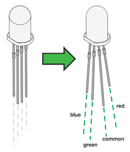
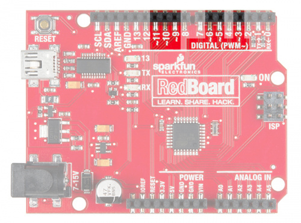

# RGB LED Lab

In this lab, we will learn how to make an RGB (Red-Green-Blue) LED display different colors by mixing red, green, and blue light.

## Concepts

### RGB LED

An RGB LED is actually three small LEDs &mdash; one red, one green and one blue &mdash; inside a normal LED housing. The RGB LED included in this kit has all the internal LEDs share the same ground wire, so there are four legs in total. To turn one color on, ensure ground is connected, then power one of the legs just as you would a regular LED. If you turn on more than one color at a time, you will see the colors start to blend together to form a new color.

Just like a regular LED, an RGB LED is polarized and only allows electricity to flow in one direction. Pay close attention to the flat edge and to the different length legs. Both are indicators to help orient the LED correctly.

Here is a picture of an RGB LED with the legs labeled:




### Varying Color and Brightness Using Analog Output (Pulse-Width Modulation)

In Circuit 3, you learned about analog output versus digital output. Now you are going to apply this knowledge to creating different colors of varying brightness.

You can use the `digitalWrite()` command to turn pins on the Arduino on (5V) or off (0V), but what if you want to output 2.5V? The Arduino doesn't have an analog output, but it is really good at switching some digital pins on and off fast enough to simulate an analog output. `analogWrite()` can output 2.5 volts by quickly switching a pin on and off so that the pin is only on 50 percent of the time (50% of 5V is 2.5V). By changing the percent of time that a pin is on, from 0 percent (always off) to 100 percent (always on), `analogWrite()` can output any voltage between 0 and 5V. This is what is known as pulse-width modulation (or PWM). By using PWM, you can create many different colors with the RGB LED.

Only a few of the digital pins on the Uno and RedBoard have the circuitry needed to turn on and off fast enough for PWM. These are pins 3, 5, 6, 9, 10 and 11. Each PWM pin is marked with a ~ on the board. Remember, you can only use `analogWrite()` on these pins.




### Circuit Diagram

Here is the circuit diagram we will use for our lab:


## Code


### Using `analogWrite`

The `analogWrite` function outputs a voltage between 0 and 5V to a pin. The function breaks the range between 0 and 5V into 255 little steps. That means each 50 steps corresponds to an increase of about 1 volt. By varying the voltage that gets sent to the red, green, and blue pins that are connected to the legs of the RGB LED, you can create 16,777,216 different colors. That's a lot of color!


### Creating Your Own Simple Functions

When programmers want to use a piece of code over and over again, they write a **function**. The simplest functions are just chunks of code that you give a name to. When you want to run that code, you can “call” the function by typing its name, instead of writing out all of the code. More complicated functions take and return pieces of information from the program (we call these pieces of information **parameters**). In this circuit, you'll write functions to turn the RGB LED different colors by just typing that color's name.

Here is a function that turns the RBG LED red:

```C
void red ()
{
  analogWrite(RedPin, 100);
  analogWrite(GreenPin, 0);
  analogWrite(BluePin, 0);
}
```


### The Full Program

Here is the full program:

```C
// LEDs are connected to these pins
int RedPin = 9;
int GreenPin = 10;
int BluePin = 11;

void setup() {
  // Set the LED pins to output
  pinMode(RedPin, OUTPUT);
  pinMode(GreenPin, OUTPUT);
  pinMode(BluePin, OUTPUT);
}

void loop() {
  // Show each color for a second
  red();
  delay(1000);
  orange();
  delay(1000);
  yellow();
  delay(1000);
  green();
  delay(1000);
  cyan();
  delay(1000);
  blue();
  delay(1000);
  magenta();
  delay(1000);

  // Turn the LED off for a second before starting over again
  turnOff();
  delay(1000);
}

/** Set the LED pins to values that make red. */
void red () {
  analogWrite(RedPin, 100);
  analogWrite(GreenPin, 0);
  analogWrite(BluePin, 0);
}

/** Set the LED pins to values that make orange. */
void orange () {
  analogWrite(RedPin, 100);
  analogWrite(GreenPin, 50);
  analogWrite(BluePin, 0);
}

/** Set the LED pins to values that make yellow. */
void yellow () {
  analogWrite(RedPin, 100);
  analogWrite(GreenPin, 100);
  analogWrite(BluePin, 0);
}

/** Set the LED pins to values that make green. */
void green () {
  analogWrite(RedPin, 0);
  analogWrite(GreenPin, 100);
  analogWrite(BluePin, 0);
}

/** Set the LED pins to values that make cyan. */
void cyan () {
  analogWrite(RedPin, 0);
  analogWrite(GreenPin, 100);
  analogWrite(BluePin, 100);
}

/** Set the LED pins to values that make blue */
void blue () {
  analogWrite(RedPin, 0);
  analogWrite(GreenPin, 0);
  analogWrite(BluePin, 100);
}

/** Set the LED pins to values that make magenta. */
void magenta () {
  analogWrite(RedPin, 100);
  analogWrite(GreenPin, 0);
  analogWrite(BluePin, 100);
}

/** Set all three LED pins to 0 or OFF */
void turnOff () {
  analogWrite(RedPin, 0);
  analogWrite(GreenPin, 0);
  analogWrite(BluePin, 0);
}
```

You can type this into the Tinkercad program or copy this code and paste it into the Tinkercad code area.


## Working Example on Tinkercad

[RGB LED on Tinkercad](https://www.tinkercad.com/things/jTbXltJyBlT-fantabulous-robo-kasi/editel?tenant=circuits)


## Experiments

1. Can you create your own function to turn the RGB LED a different color?
2. Can you turn the RGB LED white?
3. Note that we are not turning the LED on to full brightness (255) in this code so that the light is not too bright. Try changing these values and see what happens.


## Food for Thought

Why is it that to get white light, you mix red, green, and blue in equal amounts, but mixing red, green, and blue paint will not get you white paint?

If you would like to learn more about mixing light, here is a [Wikipedia Article on Color Mixing](https://en.wikipedia.org/wiki/Color_mixing)
